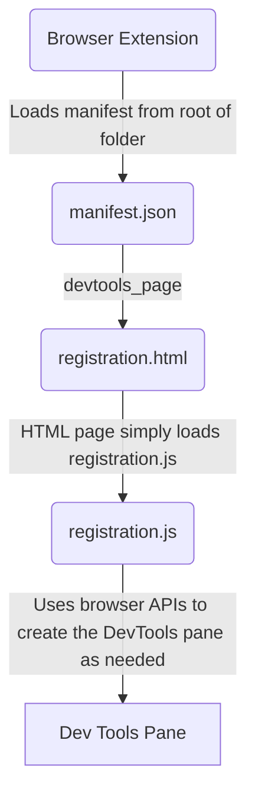

# DevTools for Umbraco Bellissima
A web browser extension that helps with Developer Experience for developing UI with the WebComponent based Umbraco backoffice (v14+) codenamed Bellissima
 
### Browser Extension Stores
Will be republished soon

## Developing
* Run `npm install` in the terminal at the root of this repository
* Run `npm run build` or `npm run watch` to have the typescript files in the `src` folder built or watched for changes
    * The typescript files are built and placed into the folder called `extension` which the browser extension will load from
    * rollup.js is used to compile the typescript files along with bundle any npm node_modules that are used such as Lit for WebComponent development
* Run `npm run start:firefox` to have FireFox open with the extension loaded and monitoring any changes to the files in the `extension` folder
* Run `npm run start:chromium` to have Chrome or chromium based browser open with the extension loaded and monitoring any changes to the files in the `extension` folder

## How it works
#### Registering DevTools Pane

## Publishing
These are notes and URLs to help remind me where all the different places & approches to different browser extension stores.

### Edge/Microsoft
* [How To Guide](https://learn.microsoft.com/en-us/microsoft-edge/extensions-chromium/publish/publish-extension)
* [Signin with GitHub account](https://partner.microsoft.com/dashboard/microsoftedge/public/login?ref=dd)

## Chrome
* [How To Guide](https://developer.chrome.com/docs/webstore/publish)
* [Chrome Portal](https://chrome.google.com/webstore/devconsole)

### FireFox
* [How To Guide](https://extensionworkshop.com/documentation/publish/)
* [Firefox Developer Addons Portal](https://addons.mozilla.org/en-GB/developers/addons)