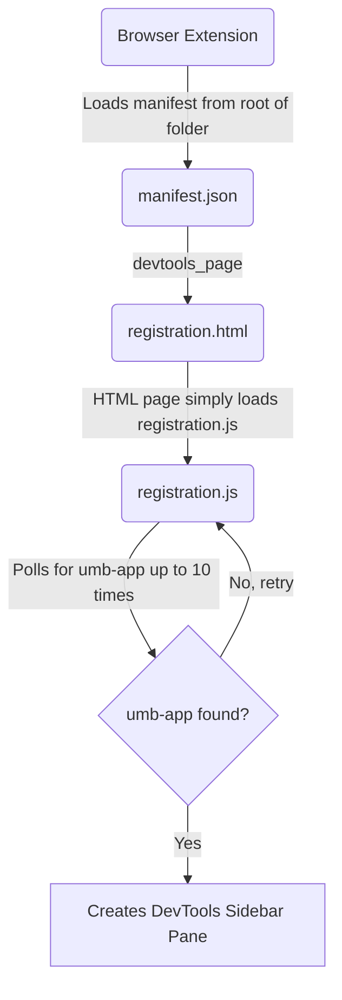
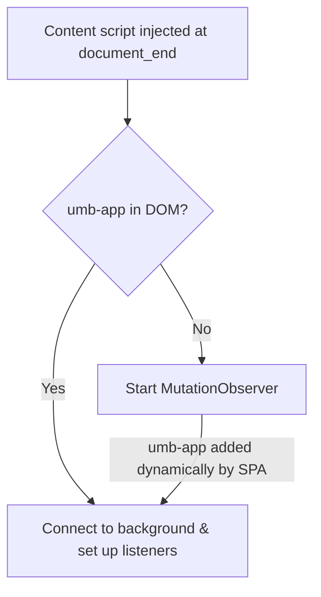
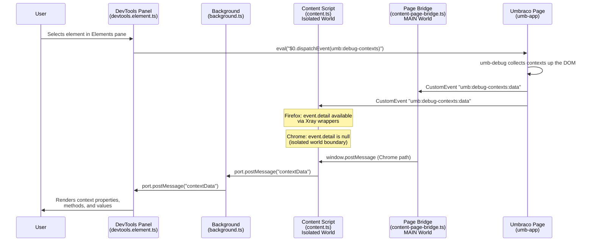
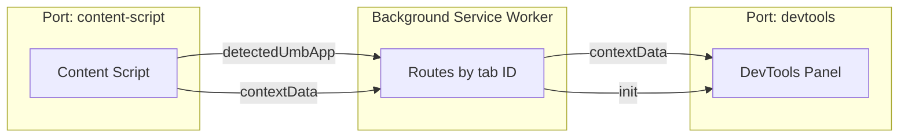

# DevTools for Umbraco Bellissima
A web browser extension that helps with Developer Experience for developing UI with the WebComponent based Umbraco backoffice (v14+) codenamed Bellissima
 
### Browser Extension Stores
Will be republished soon

## Developing
* Run `npm install` in the terminal at the root of this repository
* Run `npm run build` or `npm run watch` to have the typescript files in the `src` folder built or watched for changes
    * The typescript files are built and placed into the folder called `extension` which the browser extension will load from
    * rollup.js is used to compile the typescript files along with bundle any npm node_modules that are used such as Lit for WebComponent development
* Run `npm run start:firefox` to have FireFox open with the extension loaded and monitoring any changes to the files in the `extension` folder
* Run `npm run start:chromium` to have Chrome or chromium based browser open with the extension loaded and monitoring any changes to the files in the `extension` folder

## How it works

#### Registering DevTools Pane


#### Detecting umb-app


#### Context Data Flow


#### Background Message Routing


### Light/Dark Theme Support

The DevTools panel responds to the theme set in the browser's DevTools settings. Chrome and Firefox expose this through different APIs:

| Browser | API |
|---------|-----|
| Firefox | `browser.devtools.panels.onThemeChanged` event |
| Chrome | `chrome.devtools.panels.setThemeChangeHandler()` (Chrome 99+) |

Both browsers provide `browser.devtools.panels.themeName` to read the current theme on load. The panel sets a `data-theme` attribute on the `<html>` element which drives CSS custom properties for colours:

```
themeName === "dark"  →  data-theme="dark"   →  dark colour variables
themeName === "default" or "light"  →  light colour variables (default)
```

Note: Chrome returns `"default"` for the light theme, Firefox returns `"light"`. Checking `=== "dark"` works correctly for both.

### Chrome Isolated World and the Content Page Bridge

Chrome and Firefox differ in how content scripts access data from page-fired events.

In Chrome, content scripts run in an **isolated world** — a separate JavaScript execution context that shares the DOM with the page but has a completely separate scope. When the Umbraco backoffice fires a `CustomEvent` (e.g. `umb:debug-contexts:data`) carrying context data in `event.detail`, Chrome **strips `event.detail` to `null`** when that event is received by an isolated-world content script. This is an intentional security boundary.

Firefox handles this differently using **Xray wrappers**, which allow content scripts to safely read `event.detail` across the world boundary without stripping it.

To work around this, the extension includes a bridge script (`content-page-bridge.ts`) that is injected into the **MAIN world** (the same JavaScript environment as the Umbraco page itself) by setting `"world": "MAIN"` in the manifest:

```json
{
    "js": ["content-page-bridge.js"],
    "matches": [ "<all_urls>" ],
    "run_at": "document_end",
    "world": "MAIN"
}
```

Because it runs in the MAIN world, the bridge can read `event.detail` normally. It then re-broadcasts the data via `window.postMessage` (which uses structured cloning and crosses the world boundary safely). The isolated-world content script listens for that message and forwards the data to the background page.

```
Umbraco page JS          content-page-bridge.ts       content.ts
(MAIN world)             (MAIN world)                 (Isolated world)

CustomEvent fired   -->  reads event.detail      -->  window.postMessage listener
umb:debug-contexts:data  posts to window              forwards to background page
```

The trade-off of `"world": "MAIN"` is that the page can see and potentially interfere with the bridge script, which is why it is kept intentionally minimal — it only reads events and calls `window.postMessage`. All actual extension API communication stays in the isolated-world `content.ts`.

See the Chrome documentation for further detail:
- [Content script execution environments](https://developer.chrome.com/docs/extensions/develop/concepts/content-scripts#isolated_world)
- [Content script `world` manifest property](https://developer.chrome.com/docs/extensions/reference/manifest/content-scripts#world)


## Publishing
These are notes and URLs to help remind me where all the different places & approches to different browser extension stores.

### Edge/Microsoft
* [How To Guide](https://learn.microsoft.com/en-us/microsoft-edge/extensions-chromium/publish/publish-extension)
* [Signin with GitHub account](https://partner.microsoft.com/dashboard/microsoftedge/public/login?ref=dd)

## Chrome
* [How To Guide](https://developer.chrome.com/docs/webstore/publish)
* [Chrome Portal](https://chrome.google.com/webstore/devconsole)

### FireFox
* [How To Guide](https://extensionworkshop.com/documentation/publish/)
* [Firefox Developer Addons Portal](https://addons.mozilla.org/en-GB/developers/addons)